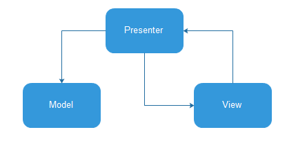

# android-mvp-retrofit2-rxjava2
采用 MVP 架构搭载 Retrofit2 + Rxjava2 + Okhttp 的一个项目框架，其中配合 Leakcanary 合理分析项目内存泄露问题


## Introduction

**Base on the MVP pattern , Retrofit2 +RxJava2+Okhttp.**

- RxJava2

- RxAndroid

- Retrofit2

- Okhttp

- ButterKnife

- LeakCanary

- utilcode

  ​


## MVP

MVP 模式的核心思想

**MVP 把 Activity 中的 UI 逻辑抽象成 View 接口，把业务逻辑抽象成 Presenter 接口，Model 类还是原来的Model。**



主要优点

- **分离视图层和业务层降低耦合**
- **Activity 代码变的简洁**
- **方便进行单元测试**
- **避免 Activity 的内存泄露**


## MVP Use


## Code

```
public interface BasePresenter {
    void subscribe();

    void unsubscribe();
}
```

```
public interface BaseView<T> {
    void setPresenter(T presenter);
}
```

```
public class MainContract {
    interface View extends BaseView<Presenter>{
        void showNewList(NewsList newsList);
    }

    interface Presenter extends BasePresenter{

    }
}
```

```
public class MainFragment extends BaseFragment implements MainContract.View {
    MainContract.Presenter mMainPresenter;
    @Bind(R.id.textView)
    TextView mTextView;

    public static MainFragment newInstance() {
        MainFragment mainFragment = new MainFragment();
        new MainPresenter(mainFragment);
        return mainFragment;
    }

    @Override
    protected int getLayoutId() {
        return R.layout.fragment_main;
    }

    @Override
    public void onResume() {
        super.onResume();
        mMainPresenter.subscribe();
    }

    @Override
    public void onPause() {
        super.onPause();
        mMainPresenter.unsubscribe();
    }

    @Override
    public void setPresenter(MainContract.Presenter presenter) {
        mMainPresenter = presenter;
    }

    @Override
    public void showNewList(NewsList newsList) {
        mTextView.setText(new Gson().toJson(newsList));
    }
}
```

```
public class MainPresenter implements MainContract.Presenter{
    private MainContract.View view;
    private HttpApi mHttpApi;
    private CompositeDisposable mCompositeDisposable;

    public MainPresenter(MainContract.View view) {
        this.view = view;
        view.setPresenter(this);
        mCompositeDisposable = new CompositeDisposable();
        mHttpApi =  HttpFactory.createRetrofit2(HttpApi.class);
    }

    @Override
    public void subscribe() {
        getNewList();
    }

    @Override
    public void unsubscribe() {
        mCompositeDisposable.clear();
    }

    public void getNewList() {
        Disposable disposable = mHttpApi.getNewsList("L295","10")
                .subscribeOn(Schedulers.io())
                .observeOn(AndroidSchedulers.mainThread())
                .subscribe(new Consumer<NewsList>() {
                    @Override
                    public void accept(@NonNull NewsList newsList) throws Exception {
                        view.showNewList(newsList);
                    }
                });
        mCompositeDisposable.add(disposable);
    }
}
```


## Thanks

[MVP](https://github.com/googlesamples/android-architecture)

[LeakCanary](https://github.com/square/leakcanary/wiki/FAQ)

[UtilCode](https://github.com/cheng2016/AndroidUtilCode)

[MVP模式简单易懂的介绍方式](http://www.360doc.com/content/16/0817/14/26794451_583847256.shtml)

## Contact Me

- Github: github.com/cheng2016
- Email: mitnick.cheng@outlook.com
- QQ: 1102743539